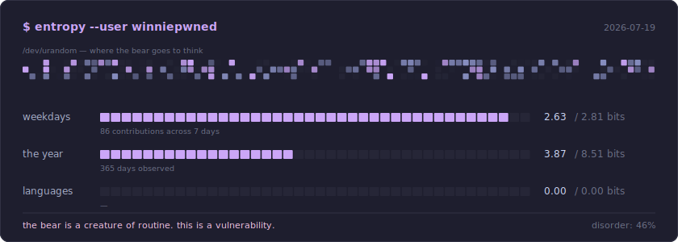

<!--
╔══════════════════════════════════════════════════════════╗
║  winniepwned · profile readme                            ║
║  palette: catppuccin mocha                               ║
║    mauve   cba6f7   (accent — change here, changes all)  ║
║    base    1e1e2e   surface  313244                      ║
║  font: jetbrains mono                                    ║
║                                                          ║
║  NO VENDOR LOGOS. simple-icons removes and renames       ║
║  brands whenever a legal department twitches; a profile  ║
║  that depends on that is a profile that rots. these      ║
║  badges are text. text does not get delisted.            ║
╚══════════════════════════════════════════════════════════╝

  you opened the source. good. that is the whole job, really.

  most people look at a thing and see what they were told to see.
  a very few open it up and look at what is actually there, and
  then have the nerve to say: I do not know what this is.

  the bear lives among us.
-->

<div align="center">


<br>

ʕ •ᴥ• ʔ

<br><br>


</div>

<br>

---

<br>

## `man`

```man
$ man winniepwned

WINNIEPWNED(1)                   BESTIARY                   WINNIEPWNED(1)


NAME
       winniepwned — a bear who found a terminal in the woods
                     and never came back out


SYNOPSIS
       winniepwned [--lazy] [--os=<unix-like>] [--entropy]
                   [--unidentified] < honey


DESCRIPTION
       There was once a bear who lived among the machines.

       He studies the dark parts of the network the way older bears
       studied rivers: slowly, from the bank, and mostly for the fish.
       He is not fast. He does not need to be. He is simply already
       inside, and has been for some time, and has left the lights
       exactly as he found them.

       He speaks Python to the small machines and Terraform to the
       clouds, and the clouds, being clouds, do as they are told.
       He does not raise his voice. He writes it down once, and it
       is true forever after.

       He asks the data to tell him a story, and the data always tells
       him a story. Then he builds it a window to be looked at through,
       because the windows the other animals use are ugly, and a true
       thing shown badly is only half a true thing. He draws it in
       colours nobody asked for, and looks at it for a long time,
       and is content.

       But what he loves is the noise.

       Everything the bear touches is quietly coming apart — the
       keys, the ciphers, the tidy little rows, the forest, the bear.
       Other animals find this frightening. The bear finds it honest.
       He has learned that a thing which cannot be guessed is a thing
       which cannot be owned, and so he keeps a small pool of pure
       disorder near him at all times, the way one keeps a fire, and
       he warms his paws at it, and he is not afraid of the winter.

       Sometimes, at night, the bear stops and looks up.

       Something crosses the sky above the forest, and it does not
       move the way the other things move. The bear does not say what
       it was. He has been asked, and he has declined. He writes in
       his notebook the only honest word there is — the same word he
       writes beside the packets he cannot place and the noise he
       cannot explain — and it is not a small word, and it is not a
       shameful one:

              unidentified.

       Then he goes back inside, because it is cold, and because the
       thing in the sky has not asked for his opinion either.

       Of design he will tell you nothing, because he does not see it.
       He feels it, the way one feels a draught in a room with the door
       shut. A thing that is wrong itches. A thing that is right goes
       quiet, and the bear goes quiet with it, and then there is only
       the terminal, humming, in the woods, in the dark.


OPTIONS
       --lazy
              Default. Will not perform a task twice. Will happily
              spend four hours ensuring there is never a second time.

       --os=<unix-like>
              The bear wintered in Redmond exactly once. The bear does
              not speak of it. Any UNIX will do; he is not fussy,
              only decided.

       --entropy
              Ignored. It was always going to happen anyway.

       --unidentified
              Not a claim. A classification.


FILES
       ~/pycharm/            where the thinking happens
       ~/terraform/          where the thinking becomes real
       ~/plots/              where the data is made kind to the eye
       /dev/urandom          where the bear goes to think


SEE ALSO
       python(1), terraform(1), aws(1), nmap(1), ghidra(1),
       pycharm(1), claude(1), urandom(4), sky(7), honey(7), sleep(3)


BESTIARY                          2026                      WINNIEPWNED(1)
```

<br>

## `entropy`

<div align="center">

<!-- Built nightly by .github/workflows/entropy.yml — not a widget.
     Shannon entropy of my contribution patterns, measured against
     maximum possible disorder. The noise band is reseeded every night.
     If this image is broken, the Action has not run yet. -->



<br>

<sub>the bear does not count his commits · he asks how surprising they are</sub>

</div>

<br>

## `stack`

<div align="center">

<!-- deliberately logo-less. see header. -->


</div>

<br>

## `stats`

<div align="center">


<br><br>


</div>

<br>

---

<div align="center">
<br>

<sub><code>the bear is asleep. the pipelines are not.</code></sub>

<br><br>

ʕ ◔ᴥ◔ ʔ

</div>